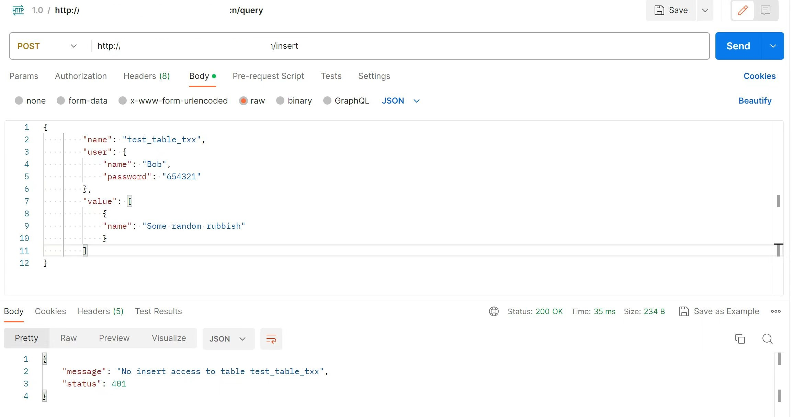

# 

A demo tool to provide a common, config-based Web API query interface for relational databases with access control.

Collaborated with @CoolChameleon , @doubley318 , and @TeresaYT .

> As an entry of the 7th CMB FinTech Camp.

## Demo





## API Spec

### Add

```json
{
    "user": {
        "name": "userName",
        "password": "userPassword",
    },
    "name": "table_name",
    
    "value": {
        "col1": "value1",
        "col2": "value2",
    }
}
```

### Update

```json
{
    "method": "update",
    "user": {
        "name": "userName",
        "password": "userPassword",
    },
    "name": "table_name",
    
    "cond": "where clause expression",
    "value": {
        "col1": "value1",
        "col2": "value2",
    }
}
```

### Delete

```json
{
    "method": "delete",
    "user": {
        "name": "userName",
        "password": "userPassword",
    },
    "name": "table_name",
    
    "cond": "where clause expression",
}
```

### Query

```json
{
    "method": "query",
    "user": {
        "name": "userName",
        "password": "userPassword",
    },
    "name": "table_name",
    
    "cond": "where clause expression",    
    // "sort": null         // for no sorting
    // + for asc, - for desc
    "sort": "col1+,col2-,col3+",
    // "page": null         // for no pagination
    "page": "pageNumber@pageSize", // eg. 2@5 second page, each page including 5 rows
    // "group": null         // for no grouping
    "group": "colName",
    "cols": [
        "col1",
        "SUM:col2",         // aggr query
    ],
    // join query, for single table query, do NOT add following attributes
    "joinTable": "join_table_name",
    "joinCond": "join on clause expression",
}
```

### Config

```json
{
    "GlobalConfig": [
        {
            "table_name": "TableName",
            "name": "AliasName",
            "add": true,
            "delete": true,
            "update": true,
            "get": true,
        }
    ],
    "UserConfig": [
        {
            "name": "UserName",
            "password": "Userpassword",
            "OperationConfig": [
                {
                    "table_name": "TableName",
                    "name": "AliasName",
                    "add": true,
                    "update": true,
                    "delete": true,
                    "get": true,
                }
            ]
        }
    ]
}
```

## Build

```sh
gradle build
```

## Run

```sh
gradle run
```